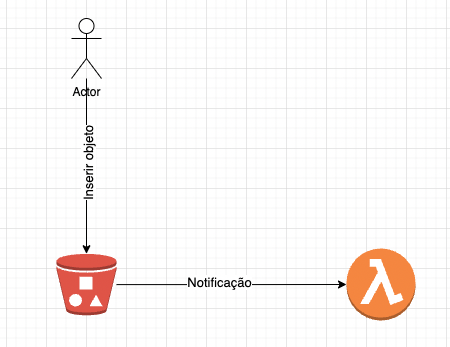

# poc-bucket-notification-lambda

Poc com a finalidade de emitir uma notificação sempre que um novo arquivo for adicionado no nosso bucket. Nessa solução o receptor será uma função lambda.

### Tecnologias

 - Docker
 - Docker Compose
 - Terraform
 - Python
 - LocalStack

### Arquitetura



## Execução com localstack

1 - Executar localstack com o docker-compose
```sh
docker-compose up
```

2 - Executar o terraform
```sh
terraform apply
```

3 - Inserir um objeto no bucket
```sh
aws --endpoint-url=http://localhost:4566 s3 cp ./proposta.log s3://origin/
```

4 - Acompanhar os logs com o tail
```sh
aws --endpoint-url=http://localhost:4566 logs tail "/aws/lambda/example_lambda_name" --follow  
```